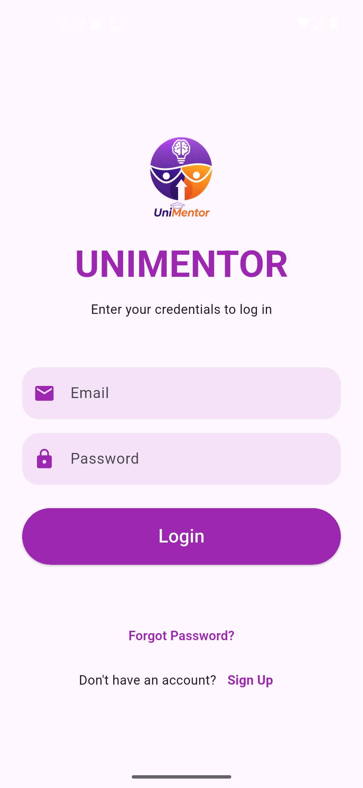
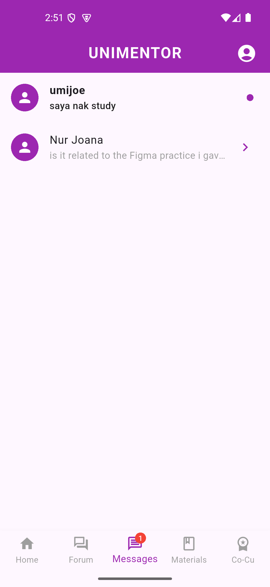

# 🎓 UniMentor

UniMentor is a mobile mentoring platform developed as a **Final Year Project** to help **Universiti Kuala Lumpur (UniKL) students** connect with mentors, manage mentoring activities, communicate, and access learning resources in one platform.

The application is specifically designed for the UniKL student community. Users are required to register or log in using an official **UniKL student email address ending with `@s.unikl.edu.my`**.

## 📱 Overview

UniMentor provides a centralized platform where UniKL students can participate in mentoring activities through mentor-mentee matching, communication, booking sessions, learning materials, reviews, and related academic activities.

The application supports both **mentors and mentees**, providing different functionalities based on their roles.

## ✨ Key Features

* 👤 **Mentor & Mentee Registration**

  * Role-based account registration
  * UniKL student email restriction

* 🔍 **Mentor-Mentee Matching**

  * Helps mentees discover suitable mentors based on their needs and interests

* 💬 **Chat**

  * Communication between mentors and mentees

* 📅 **Mentoring Session Booking**

  * Book mentoring sessions with selected mentors
  * Supports online and physical mentoring sessions

* 💳 **Booking Management**

  * Supports paid mentoring bookings

* 📚 **Learning Materials**

  * Access and manage mentoring-related materials

* ⭐ **Ratings & Reviews**

  * Allows users to provide feedback after mentoring sessions

* 🏆 **Co-Curriculum Certificate**

  * Supports certificate-related mentoring activities

* 📝 **Reports**

  * Provides reporting functionality for mentoring activities

## 🛠️ Technologies Used

| Technology                  | Purpose                                |
| --------------------------- | -------------------------------------- |
| **Flutter**                 | Mobile application development         |
| **Dart**                    | Application programming language       |
| **Firebase Authentication** | User authentication                    |
| **Cloud Firestore**         | Database and real-time data management |
| **Firebase Storage**        | File and document storage              |
| **Android Studio**          | Android development and testing        |
| **Visual Studio Code**      | Application development                |

## 🔐 Authentication & Access

UniMentor is designed specifically for the **UniKL student community**.

Users must register or log in using an official UniKL student email address with the following domain:

```text
@s.unikl.edu.my
```

This email-domain restriction ensures that the application is intended for the UniKL student community.

## 🗄️ Firebase Integration

UniMentor integrates several Firebase services:

* **Firebase Authentication** — user authentication and account management
* **Cloud Firestore** — application database and real-time data management
* **Firebase Storage** — storage for uploaded files and learning materials

## 👩‍💻 Project Contribution

UniMentor was developed as a Final Year Project as part of the Bachelor of Software Engineering (Hons) programme at Universiti Kuala Lumpur (UniKL MIIT).

I was responsible for the end-to-end development of the application, including:

* 📱 Mobile application development using Flutter and Dart
* 🎨 User interface and user experience implementation
* 🔐 Authentication and role-based access
* 🔥 Firebase Authentication integration
* 🗄️ Cloud Firestore database integration
* 📁 Firebase Storage integration
* 🔍 Mentor-mentee matching functionality
* 💬 Chat functionality
* 📅 Booking and session management
* 💳 Online and physical mentoring booking functionality
* 📚 Learning materials functionality
* ⭐ Ratings and reviews
* 🏆 Co-curriculum certificate functionality
* 🐛 Testing, debugging, and troubleshooting


## 📸 Application Screenshots

### 🔐 Authentication



### 🏠 Mentee Dashboard & Homepage


### 🔍 Mentor & Mentee Features


### 💬 Chat



### 📅 Booking


### 🏆 Mentor Co-Curricular


### 💰 Mentor Wallet


### 💬 Forum


## 🚀 Getting Started

### Prerequisites

Before running the project, make sure you have:

* Flutter SDK
* Dart SDK
* Android Studio or Visual Studio Code
* Android Emulator or Android device
* A configured Firebase project

### Installation

Clone the repository:

```bash
git clone https://github.com/fashahellal/UniMentor.git
```

Navigate to the project directory:

```bash
cd UniMentor
```

Install the required dependencies:

```bash
flutter pub get
```

Run the application:

```bash
flutter run
```

### Firebase Configuration

The project requires Firebase configuration to run correctly.

Firebase services used by the application include:

* Firebase Authentication
* Cloud Firestore
* Firebase Storage

## 🎓 Academic Project

**Bachelor of Software Engineering (Hons)**
**Universiti Kuala Lumpur (UniKL MIIT)**

**Final Year Project**
Expected Graduation: **March 2027**

---

⭐ *UniMentor — Connecting students through meaningful mentoring experiences.*
